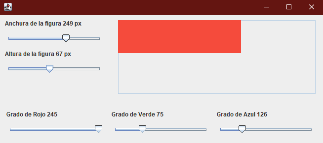

# Editor de un cuadrado para su tamaño y color con Java Swing

Permite editar una figura geometrica en tu anchura, altura y color

```bash
mkdir target
javac src/Main.java -sourcepath src -d target/
jar -cvfm program.jar manifest.mf -C target/ ./
```

## Previsual


